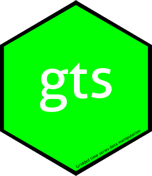

<!-- README.md is generated from README.Rmd. Please edit that file -->

```{r, echo = FALSE}
knitr::opts_chunk$set(
  collapse = TRUE,
  comment = "#>",
  fig.path = "man/figures/README"
)
```

# gts <a href="https://roliveros-ramos.github.io/gts/"></a>

<!-- badges: start -->
[](https://CRAN.R-project.org/package=gts)

[](https://github.com/roliveros-ramos/gts/actions/workflows/R-CMD-check.yaml)
[](https://github.com/roliveros-ramos/gts/issues)
[](https://www.bestpractices.dev/projects/10585)
[](https://CRAN.R-project.org/package=gts)
[](https://CRAN.R-project.org/package=gts)
[](https://app.codecov.io/gh/roliveros-ramos/gts)
<!-- badges: end -->

## Gridded time-series manipulation and analysis

`gts` provides a lightweight workflow for working with gridded environmental
arrays in R, especially data stored in netCDF files. The package is centred on
three complementary object types:

- `gts`: gridded time-series objects;
- `static`: time-invariant gridded spatial fields such as bathymetry, shelf
  break, cell area, or distance to coast;
- `grid`: spatial grid objects storing geometry, masks, and associated metadata.

The package aims to make common operations on environmental grids easier and
more reproducible inside R: reading and writing netCDF files, inspecting
metadata, subsetting in space and time, regridding, filling missing values,
computing climatologies and summaries, reshaping to tabular form, and combining
point observations with gridded products.

Full documentation is available at <https://roliveros-ramos.github.io/gts/>.

## Installation

```{r, eval = FALSE}
# CRAN release
install.packages("gts")

# Development version
install.packages("remotes")
remotes::install_github("roliveros-ramos/gts")
```

## Main entry points

For most users, the package workflow starts with one of these functions:

- `read_gts()` to read a gridded time-series from a netCDF file;
- `read_static()` to read a time-invariant gridded variable from a netCDF file;
- `read_grid()` or `make_grid()` to import or create a spatial grid.

Lower-level constructors are also available when you already have arrays and
metadata in memory:

- `gts()` to build a `gts` object from an array or an open netCDF handle;
- `make_grid()` to create a regular grid programmatically.

## Example files shipped with the package

The package includes a few small netCDF files under `inst/ncdf`. After
installation, you can access them with `system.file()`:

```{r, eval = FALSE}
library(gts)

sst_file = system.file("ncdf", "sst.nc4", package = "gts")
bathy_file = system.file("ncdf", "bathymetry.nc", package = "gts")
shelf_file = system.file("ncdf", "shelfbreak.nc", package = "gts")
```

These files are intended as quick examples:

- `sst.nc4`: a `gts` object with a time dimension;
- `bathymetry.nc`: a `static` object;
- `shelfbreak.nc`: a `static` object.

## Typical workflow

### Read bundled example data

```{r, eval = FALSE}
library(gts)

sst_file = system.file("ncdf", "sst.nc4", package = "gts")
bathy_file = system.file("ncdf", "bathymetry.nc", package = "gts")
shelf_file = system.file("ncdf", "shelfbreak.nc", package = "gts")

sst = read_gts(sst_file)
bathy = read_static(bathy_file)
shelfbreak = read_static(shelf_file)
grd = read_grid(sst_file)
```

### Inspect coordinates, masks, and resolution

```{r, eval = FALSE}
print(sst)
print(bathy)
resolution(sst)
mask(sst)
longitude(sst)
latitude(sst)
```

### Subset, fill, and regrid

```{r, eval = FALSE}
# spatial subset
sst_sub = subset(sst, longitude = c(-85, -70), latitude = c(-25, -5))
# regrid to another grid
sst_regrid = regrid(sst_sub, grd)
```

### Summarise and analyse the time dimension

```{r, eval = FALSE}
# time-series summaries
sst_t = mean(sst, by = "time")
plot(sst_t)
sst_s = sd(sst, by = "space")
plot(sst_s)

# climatology
sst_clim = climatology(sst, FUN = "mean")
plot(sst_clim, time=3)

# quantiles over time
sst_q = quantile(sst, probs = c(0.1, 0.5, 0.9))
plot(sst_q) # quantile 10% SST
```

### Work with static spatial covariates

```{r, eval = FALSE}
# static fields share much of the same interface
print(bathy)
print(shelfbreak)
area(bathy)
plot(bathy)

# arithmetic with gridded time-series objects
sst_adj = drop(sst) / sst_clim
plot(sst_adj)
```

### Reshape or merge with point data

```{r, eval = FALSE}
# long-format tables
sst_long = melt(sst)
View(sst_long)
```

### Write results to netCDF

```{r, eval = FALSE}
write_ncdf(sst, "sst_out.nc")
write_ncdf(bathy, "bathymetry_out.nc")
write_ncdf(grd, "grid_out.nc")
```

## Core features

- Read and write netCDF-backed gridded data.
- Work with time-varying (`gts`) and time-invariant (`static`) gridded objects.
- Store and reuse spatial grid metadata through `grid` objects.
- Use familiar time-series generics such as `time()`, `frequency()`,
  `window()`, and `cycle()` on gridded time-series objects.
- Regrid, interpolate, subset, and fill environmental grids.
- Compute climatologies, summaries, quantiles, and vertical integrations.
- Reshape gridded objects to tabular form and merge them with point records.

## Learn more

```{r, eval = FALSE}
# package introduction
vignette("gts")

# open the pkgdown site
browseURL("https://roliveros-ramos.github.io/gts/")
```

## Contributing

Bug reports, feature requests, and documentation improvements are welcome at
<https://github.com/roliveros-ramos/gts/issues>.

Pull requests are also welcome. Please note that `gts` is released with a
Contributor Code of Conduct. By contributing to this project, you agree to
abide by its terms.
